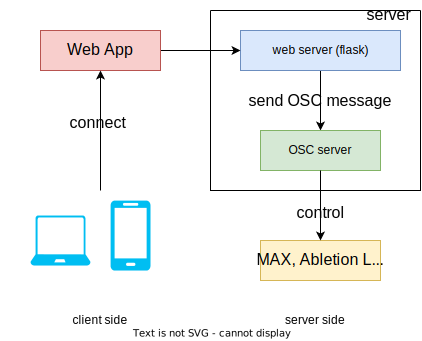

# CMAT
## Architecture




## Installation

```sh
pip install -r requrements
```
or
```sh
pip install python-osc && pip install flask
```

## How to run web server
```sh
cd ./web
flask run --host=0.0.0.0 --debugger
```

## How to run OSC server
```sh
cd ./osc
python server.py
```


